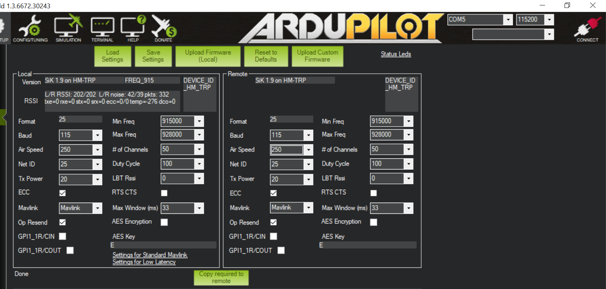
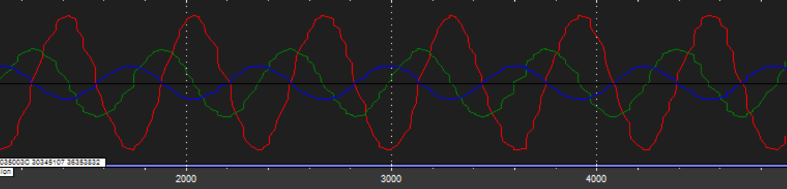
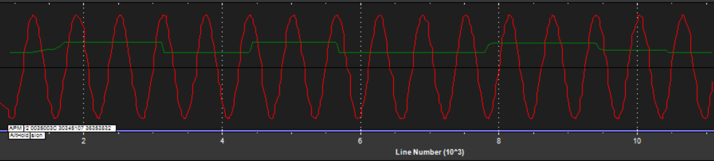

# ArduPilot project used for holodeck demo

## Introduction
This branch maintains the customized firmware I use for the demo in Holodeck. This branch demonstrates:
1. How to create a new MAVLink message to send Vicon data to the board.
2. How to implement an LQR controller.
3. How to use ROS to send fake MAVLink messages.

## Prerequisites
A VM that runs Ubuntu >= 16.04. 

## Build

### Build and load ArduCopter
The steps below are tested on Ubuntu 16.04.
* Clone the repository: `git clone https://github.com/dut09/ardupilot.git`
* Checkout my branch: `git checkout holodeck-demo`
* Update the submodule in that branch: `git submodule update --init --recursive`
* To install, run this script: `Tools/scripts/install-prereqs-ubuntu.sh -y`
* Then reload the path: `. ~/.profile`
* Use waf to configure the system from the root ardupilot directory: `./waf configure --board px4-v2`
* Build the copter code: `./waf copter`
* Once the build is successful, connect the Pixhawk using a USB cable, then run the following command:
```
./waf --targets bin/arducopter --upload
```

### Setup ROS to send MAVLink to the board
You need to install ROS. The code is tested with ROS Lunar.
* Follow [this link](http://wiki.ros.org/lunar/Installation/Ubuntu) to install ROS Lunar.
* Follow [this link](http://wiki.ros.org/ROS/Tutorials/InstallingandConfiguringROSEnvironment) to configure your catkin workspace correctly. 
* Install the following dependencies:
```
sudo aptitude install ros-lunar-sensor-msgs python-serial python-tz
```
* Make sure you have run `./waf copter` before you proceed. This command will automatically generate MAVLink code from XML definitions.
* Run `setup_roscopter.py` from the root folder:
```
python setup_roscopter.py
```
* Connect Pixhawk to your laptop using a USB cable.
* Now in your catkin workspace folder, run ```roscore```.
* Open a separate terminal, navigate to the catkin workspace folder, then run:
```
rosrun roscopter simulate_vicon_topic.py
```
By default, the command above will publish constant location and orientation data. Alternatively, you can use
```
rosrun roscopter simulate_vicon_topic.py --type=sin
```
to generate 0.5Hz sinusoidal location and orientation data. This is especially useful for debugging your setup of Vicon later. In the real experiments, you will need to replace it with a rostopic that publishes true Vicon data.
* Next, open a seperate terminal, navigate to the catkin workspace folder, then run:
```
rosrun roscopter roscopter_node.py --device=/dev/ttyACM0 --baudrate=115200 --enable-vicon=True --vicon-name=/copter
```
* If everything works well, you should see:
```
Waiting for APM heartbeat
Heartbeat from APM (system 1 component 1)
Sending all stream request for rate 10
```
Next, you should see a lot of `MocapPosition` messages in the form of:
```
name: "fake vicon data"
sample_count: XXX
translational:
  x: 4000
  y: 2000
  z: 1000
axisangle:
  x: 1.0
  y: 2.0
  z: 4.0
```

### Send real Vicon data to the board
This section is most useful for people flying their copters in [Holodeck](http://groups.csail.mit.edu/hq/wiki/bin/view/HQ/Holodeck) at MIT CSAIL.
* Connect to the WiFi in Holodeck.
* Make sure Vicon is turned on and our copter is calibrated and selected. You will need to get trained from someone who already knows how to use the Vicon system.
* Run the command in `command.txt` on the linux machine connected to Vicon.
* Now if you run `rostopic` on that machine, you should see your copter. 
* On your local Ubuntu system, add two lines to your `~/.bashrc`:
```
function master() { export ROS_MASTER_URI=http://"$1":11311; }
master <IP address of the linux machine>
````
This allows your local machine to fetch data from rostopics on the linux machine.
* Now if you run `rostopic` on your machine, you should see your copter.
* Open a new terminal, then type:
```
roscd
rosrun roscopter roscopter_node.py --device=/dev/ttyACM0 --baudrate=115200 --enable-vicon=True --vicon-name=/your_copter_name
```
Now you should see a lot of `MocapPosition` messages as before. This means you have successfully initiate the following information flow: Vicon <-> your local machine -> Pixhawk.

* Checking the rate of the Vicon publisher: Assuming your copter is named as `my_copter`, you can run `rostopic hz /my_copter` to check its frequency. At the time of writing this doc, it gave me an average rate of around 120Hz. This seems good enough. However, when I ran `rostopic echo /my_copter -p`, I noticed the Vicon node did not publish these 120 packets in one second uniformly: it sent out 4 to 6 packets almost simultaneously, then waited for 0.04s, then published 4 to 6 packets simultaneously again.

To resolve this issue, we add an optional `--vicon-rate` flag in `roscopter_node.py`. This will try its best to uniformly resample Vicon data and send them to Pixhawk at `vicon-rate`. The default rate is 25, which worked well in my experiments.

* Checking delay or distortion in the communication between Vicon and Pixhawk. This is **extremely important**. First, let's verify if there is any delay between Vicon publisher and your local machine (which is very unlikely): open `roscopter_node.py` and add `print(x, y, z)` in `send_vicon`, then run:
```
rosrun roscopter roscopter_node.py --device=/dev/ttyACM0 --baudrate=115200 --enable-vicon=True --vicon-name=/my_copter
```
In the meantime, keep your copter still and keep an eye on your screen (should print roughly the same numbers at this point). Now quickly move your copter and see if the numbers on your screen change at the same time (It should be).

Now the remaining thing to check is the communication between your local machine and your Pixhawk. The theory behind this is as follows:
1. We send out a faked sinusoidal Vicon signal to Pixhawk;
2. We hold the throttle of the transmitter still and simulate a step signal by pushing or pulling it quickly when the sinusoidal signal reaches its peak;
3. Both the signal and the throttle are logged in Pixhawk. We check if it is still a sine wave, and if the transmitter and the Vicon signals can match.
We will cover them after setting up the telemetry.

* (**Optional but highly recommended**) Telemetry setup: Unless you are lucky, it's likely that you need to change the parameters in your telemetry to send Vicon without any distortion or delay. Plug in the USB side to your local machine and power your Pixhawk using a battery. By default the two telemetries should be able to talk to each other. Now open your Mission Planner, navgiate into `INITIAL SETUP` -> `Sik Radio`. Make sure you choose the right port on the top right, and click `Load Settings`. We changed `Air Speed` to 250 and `Max Window` to 33. These two changes sacrifice the effective range of the telemetry to avoid delay or distortion, which is ok since Holodeck is very small (10m at most I guess). Below is the screenshot of our setting for your reference:


One thing to remember is that you need to **always use the same parameters for both telemetries**, otherwise they won't talk. The correct way to update the parameters is:
1. Wait for the LED lights on both telemetries to become solid green. This means they have established the connection;
2. Click on `Load Settings` and wait. You should see parameters from both telemetries on the screen;
3. Modify your local setting, then click on `Copy required to remote`;
4. Finally, click `Save Settings`. This button updates parameters in both telemetries.
A common mistake I made was that I updated the telemetry on my local machine **before** copying the same parameters to the remote telemetry on Pixhawk. If this happens to you, you will need to reestablish the communication by reverting parameters in the local telemetry first.

* Now we are ready to check the delay and distortion. Here is how:
1. Open a terminal and type:
```
rosrun roscopter simulate_vicon_topic.py --type=sin
```
2. Open another terminal, type `rosrun rqt_plot rqt_plot`, and add `/copter/translational/x` in the UI.
3. Open a third terminal, type:
```
rosrun roscopter roscopter_node.py --device=/dev/ttyUSB0 --baudrate=57600 --enable-vicon=True --vicon-name=/copter
```
4. Now power on and arm your copter, hold the throttle and push or pull it quickly when `/copter/translational/x` reaches its peak. Repeat multiple times.
5. Use Mission Planner to load the log. Check `X`, `Y`, and `Z` in `VCN`. If they are all sine waves, your communication has little or no distortion. We have attached our results for your reference:

6. Uncheck `Y` and `Z` and check `CH3` in `RCIN`. If the step function aligns well with the peak of the sine wave, your communication has little or no delay. See the image below for reference:


* Jie proposed a much better way to check if the telemetry has any delay or distortion: you simply put your copter in the real Vicon environment and check the euler angles are the same as those from IMU.

## Motor test
You will need to use a [dynamometer](https://www.rcbenchmark.com/dynamometer-series-1580/) to collect data from your motor and propeller. We have provided you a javascript script `discrete_measurement.js` and our test data in the `motor_test/` folder for your reference. Copy this script to RCBenchmark software, make sure you understand all the safety requirements, and run the script to collect data. You only need to measure PWM, current, voltage, thrust, and torque. We suggest you start with a 100% battery and run the script several times until the battery becomes 50%.

Once you are done with the measurement, create a new folder in `motor_test` and rename your measurement files as `motor_test_01.csv`, `motor_test_02.csv`, etc. Now in the root folder, run:
```
python get_motor_info.py --dir=<your motor folder>
```
It will fit the data and print the results on the window.

## Troubleshooting

### Installation
Make sure you are using the 'default' Python on Ubuntu (`/usr/bin/python` and `/usr/bin/python3`) instead of using Anaconda, miniconda, conda, etc. This will resolve a lot of python-related build errors. You can add the following lines to your `~/.bashrc` file:
```
alias python=/usr/bin/python
alias python3=/usr/bin/python3
```
then do `source ~/.bashrc`. It's important to make sure `python` points to `python2` not `python3`. Now if you type `python` you should see something like `python 2.7.12 (Default, ...)`. Note that python2 is sufficient for a successful compilation. After setting python you should see no errors when you use the `./waf` commands for compilation.
